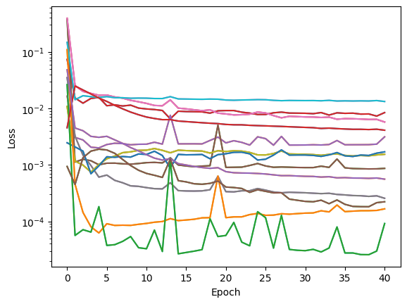
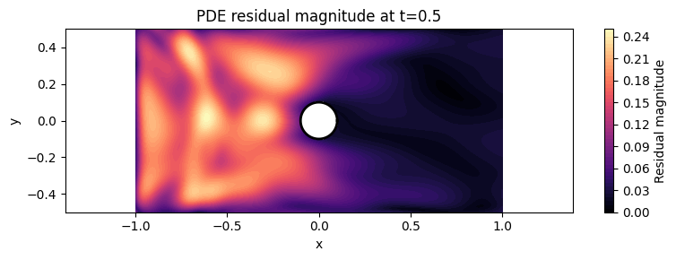

# Architecture choices for the Navier Stokes Challenge 
## Physics-Informed Neural Networks (PINNs)
### by: Andreea-Ioana Florea

## Why PINN?
The reason as to why I decided to do the **PINN** is because other **ResNet** requires for me to have all the data prepared.
That is a very high demanding task which would take a while to do. 
Using the **PINN** it allows to generate data as I go through the coding and trains the model in regards with the equation by checking it. 
It is more flexible to play around with, making testing much more feasible. 

# Methodology
## Import the Libraries

The first section is made to set up the tools required to 
generate data, build, train, run, evaluate and visualize the results of the model. 

Imported: 
* **DeepXDE** which is specifically made for **PINNs** as it does the heavy calculation of the derivatives and training for the physics of the project. 
* **TensorFlow** is used in the project as a backend engine for optimization of the DeepXDE's workload, the other possible backend is PyTorch, however for this project it has been decided to use TensorFlow as it is much more user-friendly. 
* **NumPy** is used for miscellaneous calculations.
* **Matplotlib** is used for handling the animation. 

## Data Pipeline

### Parameter Definition
After that the parameters are made to define the *physical properties* of the fluid and the resolution of the simulation.
We have the *density* and *viscosity* that define the fluid type. in the **u_in** function the speed of the flow from the left to the right is set. 
The **num_domain**, **num_boundary** and the **num_initial** determine random points also known as *collocation points*, the AI will check if the physics laws are being respected.
There is a difference between Computational fluid dynamics and this project us that the Neural Network just checks the random points in space. 

### Geometry 
The geometry cell of the project helps us define the domain in which we will perform the simulation (where the fluid flows)
The creates the **channel** and **cylinder** which represent the rectangle and the circle. We then subtract the channel from the cylinder (**channel - cylinder**). This is where the obstacle sits in the domain.
The **GeometryXTime** function merges the 2D with the 1D domain. It creates  3D space that helps???? 

### Defining the Navier Stokes equation
The PDE function implements the ***Navier-Stokes*** equation which is used. The equation calculates the derivatives of the velocity and pressure. The AI to get the result of the equation as close to 0 as it can. 

### Boundaries

Definition of the boundary functions that check whether a point in space is colliding with a boundary. It is crucial for those functions to be efficient as it can directly hinder the performance of the data generation. As well as that we define the inlet profile which lets us control the incoming flow of fluid.

### Data generation

In this step I am preparing the data for training the neural network. I have settled at the parameters.

### Neural Network 
Here is where the Neural network is training and guessing the behavior of the fluid. The neural network is a simple fully connected neural network of the size `[3] + [64] * 3 + [3]`, throught testing I have tried multiple model sizes and I have settled at this size as it produces the neural network that is large enough to capture required patterns and small enough to be trained very quickly. Normally 30k epochs require around 400 seconds on Google Colab T4 GPU. I have tried the model sizes up to `[3] + [128] * 6 + [3]` but they have proven to be inefficient in the required task.

I am training the neural network for 40k epochs which shows the best convergence. The residual plot confirms: 

On it we can see that in general the loss gradually falls however some parameters are rising in loss so on average the best point to stop training appears to be around 40k.

As well as that we can visualize the residual error of the model in comparison to the mathematical function:

### Visualization 
We are creating an animation of the plot which shows the velocity of the fluid and the direction it takes from the arrows. 

# Results

`L2 residual per equation: [0.07511157 0.05598856 0.02720737]
Total L2 residual: 0.05632272`

The model has achieved quite a low L2 result which states that it is fairly competent at estimating the equiation. As well as that we can refer to the plot of the residual error above.

In addition to better see the result of the model, the [animation has been added to this repository](animation.mp4).